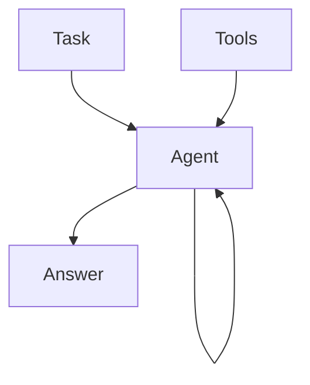

## Overview

An agent is born when you initiate llm to inner thinking process. `Tools` allow agent to interact with outside world.

`Multiagent systems` consists of agents interacting with each other to accomplish a particular goal.
